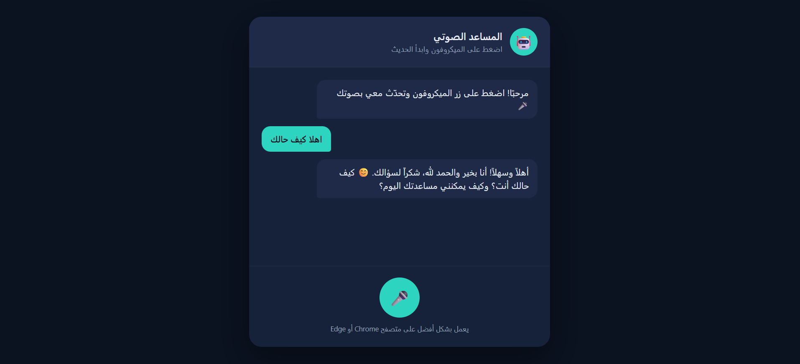

# Voice Chatbot — Powered by Gemini API

A simple voice-based chatbot: the user speaks into the microphone, the browser
converts speech to text (Speech-to-Text), the text is sent to a PHP backend
that securely calls the Gemini API, and the reply is displayed on screen and
spoken back out loud (Text-to-Speech).

🔗 Live site: `https://tala.kesug.com/chat/`

<!-- Add a screenshot of the chat interface here, for example: -->
  

## File Structure

```
/
├── index.html          # Chat UI
├── style.css           # Styling
├── app.js              # Mic logic + speech synthesis + backend calls
├── README.md
└── api/
    ├── handler.php      # Receives text from app.js and calls Gemini API
    ├── config.php        # Holds the Gemini API key (never pushed to GitHub)
    └── .htaccess          # Blocks direct browser access to config.php
```

## Deploying to the Server (InfinityFree) — Task 1

1. A subfolder `chat/` was created inside `htdocs/` on InfinityFree hosting,
   and all frontend files (`index.html`, `style.css`, `app.js`) plus the
   entire `api/` folder (`handler.php`, `config.php`, `.htaccess`) were
   uploaded into it via the hosting's File Manager.
2. The final site path became: `https://tala.kesug.com/chat/`
3. `app.js` uses a relative path
   (`const BACKEND_URL = "api/handler.php";`) so the call works correctly
   regardless of where the project is hosted.
4. `config.php` was opened and the real Gemini API key was added in place
   of the placeholder text.

## Problems Found and Fixed (Task 2)

When first testing the site, the following error appeared after every voice
message:

> "An error occurred while connecting to the server, please try again."

The issue was traced in detail using the browser's developer tools
(Network / Console tabs), and turned out to be **several separate problems**
stacked on top of each other, solved one by one:

### Problem 1 — The backend PHP file was missing entirely

The file `app.js` was calling didn't exist on the server at all. It was
written from scratch so that it:
- Receives the request as JSON: `{ "prompt": "..." }`.
- Validates that the request is `POST` and the text isn't empty.
- Calls the Gemini API via cURL using a key stored in a separate
  `config.php` file (keeping the key out of any browser-facing code).
- Always returns valid JSON, even on error — because any non-JSON response
  (like a raw PHP error page) breaks `res.json()` in app.js and triggers the
  same generic error message.

### Problem 2 — The new Gemini API key format

Google recently changed the format of Gemini API keys issued from AI Studio:
new keys now start with `AQ.` instead of the older `AIzaSy...` format. These
new keys **must** be sent via an `x-goog-api-key` header — they don't
reliably work when passed as a `?key=...` URL parameter. The backend code was
updated accordingly:

```php
CURLOPT_HTTPHEADER => [
    'Content-Type: application/json',
    'x-goog-api-key: ' . GEMINI_API_KEY,
],
```

### Problem 3 — InfinityFree was blocking a specific filename

After fixing the file and the key, a **403 Forbidden** error kept appearing
when accessing the backend file specifically (while `config.php` in the same
folder loaded fine). After ruling out file permissions and `.htaccess`, it
became clear the free hosting provider automatically blocks certain
filenames as a security measure. **Fix:** the file was renamed to
`handler.php` and the matching path in `app.js` was updated — the issue was
resolved immediately.

### Problem 4 — The gemini-2.5-flash model was no longer available

After fixing the blocking issue, a new error appeared in the Gemini
response: `"This model models/gemini-2.5-flash is no longer available"`.
Google had deprecated that model. The model name in `config.php` was
updated to the current stable model:

```php
define('GEMINI_MODEL', 'gemini-3.6-flash');
```

After that, the voice assistant worked end-to-end: it listens, sends the
text to Gemini, receives a reply, and displays/speaks it back.

### Additional Security Measures

- `api/config.php` was added to store the Gemini API key separately from
  the rest of the code, protected by `.htaccess`:
```apache
<Files "config.php">
    Order Allow,Deny
    Deny from all
</Files>
```
- `api/.gitignore` was added containing `config.php` so the real API key is
  never accidentally pushed to GitHub.
- Raw PHP error output was disabled in production
  (`display_errors = 0`) so no HTML error text gets mixed into a JSON
  response — a common bug that breaks the frontend.

